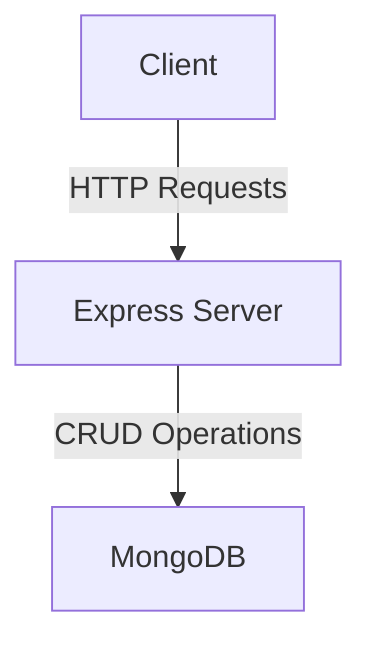
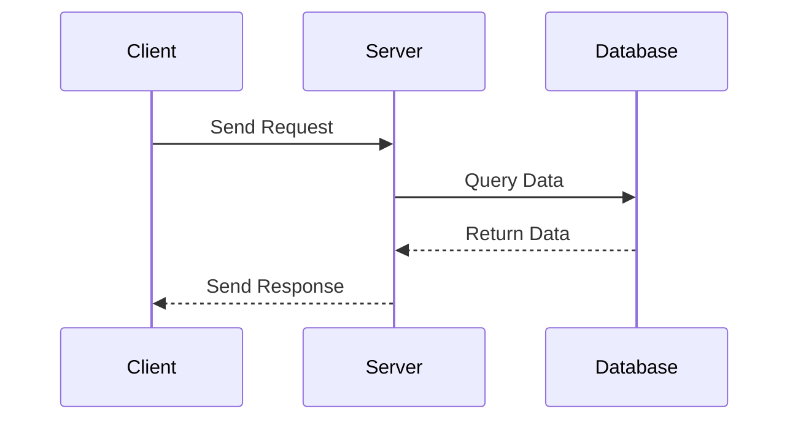

# Sample Node.js Application

This document provides an overview of a sample Node.js application, including architecture and flow diagrams created using Mermaid.

## Table of Contents
1. [Introduction](#introduction)
2. [Architecture](#architecture)
3. [Flow Diagram](#flow-diagram)
4. [References](#references)

## Introduction
This sample Node.js application demonstrates a basic setup with Express.js, MongoDB, and a simple REST API.

## Architecture
The architecture of the application is depicted in the following diagram:

## Flow Diagram
The flow of the application is illustrated in the following diagram:

## References
- [Node.js](https://nodejs.org/)
- [Express.js](https://expressjs.com/)
- [MongoDB](https://www.mongodb.com/)
- [Mermaid](https://mermaid-js.github.io/mermaid/)
